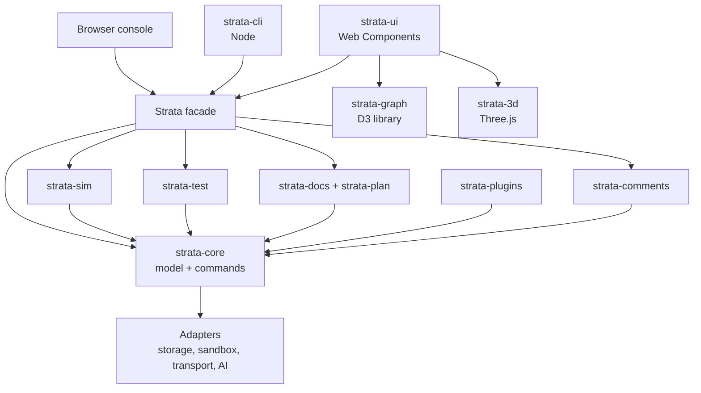

# 4. System architecture

Strata is a headless core wrapped by a single public facade; every client (web UI, browser console, Node CLI, future SaaS API) talks only to that facade. Environment differences live in swappable adapters, so the same core runs from `file://`, a local server, Node and the cloud.

Dependencies point downward only. `strata-graph` knows nothing about Strata; a view adapter in `strata-ui` maps the model to graph data and graph intents back to commands.

## Packages

| Package | Responsibility | Runs in |
| --- | --- | --- |
| strata-core | Entity store, command bus, undo/redo, op log, events, queries, validation, recursion resolver, roll-up engine | Main thread, worker, Node |
| strata-facade | The public `strata` API, composed from the packages below | Main thread, Node |
| strata-plugins | Registry, manifest validation, loaders for script tag, server, upload and filesystem | Main thread, Node |
| strata-sim | Discrete-event kernel, method dispatch, scopes and stubs, snapshots, run tree, chaos, metrics | Web Worker, `worker_threads` |
| strata-debug | Breakpoints, stepping in every unit, time travel, state and method inspection, trace recorder | Worker + facade |
| strata-test | Test DSL, runner, architecture rule engine, reporters (pretty, JSON, JUnit XML) | Worker, Node |
| strata-docs | Doc model, templates, live bindings, exporters | Main thread, Node |
| strata-plan | Tickets, generation rules, boards, exporters | Main thread, Node |
| strata-comments | Threads, anchors, outdated/orphan detection, roll-up counts | Main thread, Node |
| strata-storage | IndexedDB, sessionStorage, localStorage, file, Node fs, remote adapters | Per environment |
| strata-graph | Generic D3 diagramming library (§10) | Browser |
| strata-3d | Three.js stack and isometric views, lazy-loaded | Browser |
| strata-ui | Shell, panels, inspector, editors, theming | Browser |
| strata-cli | `pack`, `serve`, `run`, `test`, `lint`, `docs`, `tickets`, `repl`, `script` | Node 20+ |
| strata-server | Local server (R0), sync server (R4), SaaS services (R5) | Node |

## Runtime matrix

Two browser rules shape the offline build: Chromium refuses ES-module scripts and `new Worker('file.js')` from `file://` pages. The offline build therefore uses classic scripts and Blob-URL workers.

| Environment | App loading | Component discovery | Sandbox | Storage |
| --- | --- | --- | --- | --- |
| Offline `file://` | `strata.html` + classic IIFE scripts; D3 and Three vendored locally | Manual `<script>` tags for packed bundles; uploads | Blob-URL Web Worker | IndexedDB, sessionStorage, File System Access or download |
| Local server (`strata serve`) | Same HTML over `http://localhost` | Runtime scan of `components/` with file watching | Web Worker | IndexedDB + disk via server |
| Node headless | `require('strata-core')` or `strata` CLI | Filesystem scan | `worker_threads` | Filesystem |
| SaaS (R5) | CDN-hosted build | Org and public registry | Web Worker + isolated server workers | Server database, IndexedDB as cache |

## Build

Source is authored as ES modules for developer comfort. An in-house, zero-dependency bundler (the same code behind `strata pack`) emits an IIFE build exposing the global `Strata`, a CommonJS build for Node, and the offline `strata.html`. End users never run a build for the app itself.

---
Part of the [Strata Product and Technical Specification](README.md).
