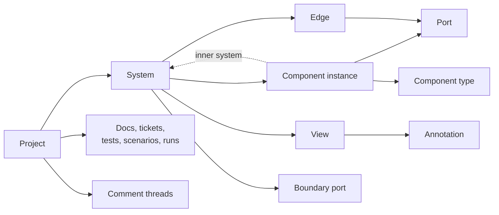

# 5. Domain model

The architecture is a directed graph: every node is a component, and every edge connects a port on one component to a port on another. Views record how the graph is drawn. Everything else (docs, tickets, tests, comments, runs) attaches to the graph by id.

## Graph invariants

- **Every node is a component.** Each has a component type (`typeRef`, such as `strata.message-queue@1.0.0`). There are no untyped nodes. Notes, callouts and frames are drawing elements in views, not graph nodes.
- **Components connect only through edges.** An edge joins an output-capable port on one component to an input-capable port on another. Ports whose direction is "both" can be either end.
- **Parallel edges are allowed,** for example an HTTP call and an event stream between the same two components.
- **Self-loops are not allowed.** A component calling itself is a private method call (§6).
- **Edges never cross levels.** Traffic between a component's inner system and the outside passes through boundary ports (§7).
- **Cycles through other components are allowed,** such as a service consuming its own events through a queue, and they simulate normally.

The dotted arrow is recursion: any component may own an inner system, which is itself a graph (§7).

| Entity | Key fields | Notes |
| --- | --- | --- |
| Project | id, name, rootSystemId, pinned component versions, settings, schemaVersion | One `.strata` file = one project |
| System | id, name, levelTag (context, container, component, custom), components, edges, boundaryPorts, views, contract | A graph: the root, or the inner system of a component |
| Component instance | id, systemId, typeRef `id@version`, props, initialState, innerSystemRef (optional), runMode (black box or expanded), tags, owner, status (planned, existing, deprecated) | Positions are stored in views, not here |
| Port | id, componentId, name, direction (in, out, both), accepted connection types, exposed public methods | Declared by the manifest, extendable per instance |
| Edge | id, fromPort, toPort, connectionType, props (timeout, retries, routing rules, method binding, schema), label | Always connects ports on two different components |
| Boundary port | id, systemId, name, direction, internalPortId, method bindings | Mirrors one port of the component that owns the system |
| View | id, systemId, kind (logical, deployment, data flow, custom), pages, layers, layout (positions, sizes, waypoints), filters, styles | Many views per system; deleting from a view only hides |
| Annotation | id, viewId, kind (note, callout, text, shape, region, frame), content, style | Visible and exported with the view (§17) |
| Comment thread | id, anchor, type, status, comments | Discussion, not exported by default (§17) |
| Scenario, Test | id, systemId, definition, scope, seed | Scopes are defined in §11 |
| Run | id, scope, seed, parentRunId, branch point, run-only edits, results | Runs form a tree when branched (§12) |
| Doc, Ticket | id, type, body or fields, links | Linked to entities for traceability |
| Operation | id, actorId, timestamp, command, payload, inverse, modelRev | The op log: undo, history, sync, audit |

## Identity and metadata

Every entity carries a ULID, `createdBy`, `createdAt`, `updatedBy`, `updatedAt` and `rev`. ULIDs are sortable and collision-safe offline, which lets R4 merge edits made on disconnected machines.

Deleting a component from the model removes it from every view after a confirmation that lists those views. Deleting it from one view only hides it there.

---
Part of the [Strata Product and Technical Specification](README.md).
