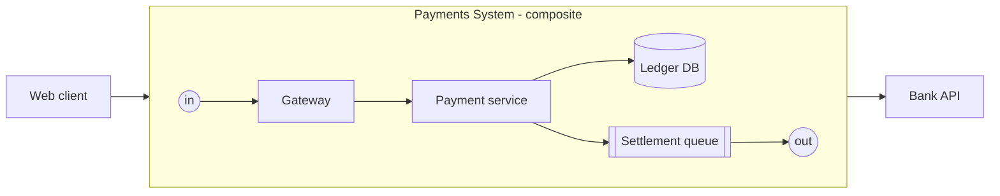

# 7. Recursion: drill-down and roll-up

Any component can own an inner system, and every component inside that system can own one too, to any depth. Drill-down moves into a component's inner system. Roll-up either folds a selection into a new component with an inner system, or aggregates values from inner systems upward.

The parent sees one component with an `in` port, an `out` port and public methods such as `authorise` and `refund`. Inside, `in` is a boundary port connected to the gateway, and each public method is bound to a public method of an inner component.

## Opening any component as a system

- **Open as system** gives any component an inner system. Its ports become boundary ports on the inner frame, and each of its public methods is listed as unbound, ready to be wired to a component inside.
- The component keeps its behaviour, which becomes its black-box model. The parent's runs are unaffected until the inner system is complete and a run chooses Expanded.
- **Remove inner system** deletes the inner system after confirmation, leaving the component black box only.
- The generic **System** component (`strata.system`) is a component whose inner system is required and whose black-box model is its declared contract.

## Boundary ports and method bindings

- An inner system's boundary ports mirror its owner's ports one to one. Adding, renaming or removing a port on the owner updates the boundary ports in the same command.
- Each public method of the owner is bound to exactly one public method of a component inside, reachable from the matching boundary port. Unbound methods appear in Problems and fail with `E_METHOD_UNBOUND` when an expanded run calls them.
- From the parent's point of view everything inside is private: the parent can call only the owner's public methods. Encapsulation therefore holds at every level.

## Placement modes

| Mode | Behaviour | Typical use |
| --- | --- | --- |
| By reference | The inner system is linked and version-pinned; read-only in this parent; changes are made in the source and propagate on version bump | Shared platform systems such as "Standard Auth Service" |
| By value | An editable copy of the inner system, detached from its source | Forking a pattern to customise it |

The core rejects any placement that makes a system contain itself, directly or through descendants. References across project files arrive in R3 and org-registry references in R5.

## Drill-down

- **Enter** (double-click or Enter): animated zoom into the component's inner system, IcePanel-style. A breadcrumb and the depth column show the path; Escape with nothing selected goes up a level.
- **Context ghosts:** the parent's neighbours appear as faded components outside the frame, so you never lose where traffic comes from.
- **Peek:** expands an inner system in place on the parent canvas, read-only by default, to show internals without leaving the level.
- **Level tags:** C4 levels (context, container, component) are tags on systems, not structural limits. Depth is unlimited; the UI is tested to 10 levels.

## Structural roll-up

- **Extract as system:** select components, then extract. Strata creates a System component, moves the selection into its inner system, creates a boundary port for every edge crossing the selection, turns the methods called across those edges into bound public methods, and rewires external edges, all as one undoable command.
- **Inline system:** the inverse. It dissolves an inner system into its parent and reconnects edges through the removed boundary ports.
- **Save as pattern:** stores a system in the library for reuse by reference or by value.

## Data roll-up

Component manifests declare how each property and metric aggregates upward; systems can override. A composite shows derived values as read-only and may also declare a contract, such as p99 ≤ 200 ms. A mismatch between contract and derived value raises a Problems entry.

| Rule | Aggregation | Example |
| --- | --- | --- |
| sum | Add inner values | Monthly cost, instance count, storage GB |
| min-path | Bottleneck throughput along each in → out path | Max sustainable req/s |
| critical-path | Longest latency along each in → out path | p99 latency of the system |
| worst | Worst status inside | Health, availability tier |
| product | Multiply availabilities along serial paths | Composite availability % |
| union | Merge sets | Protocols, tags, technologies |
| count | Count matching items in the subtree | Open comments, failing tests, open tickets, unresolved ADRs |

Count roll-ups drive badges on composites, so a parent diagram shows where the open questions and failures sit.

## Black-box models for composites

Per run, each composite runs Expanded or as a Black box (§6). Its black-box model comes from its own behaviour, its declared contract, or calibration from an earlier expanded run, which records latency distributions, capacity and error rates per public method. This keeps large systems fast to simulate and lets teams stub unfinished subsystems.

## Everything attaches at every level

Docs, ADRs, tickets, tests and comments can attach to any system or component at any depth. The doc tree and the epic tree mirror the system tree by default (§15, §16).

---
Part of the [Strata Product and Technical Specification](README.md).
