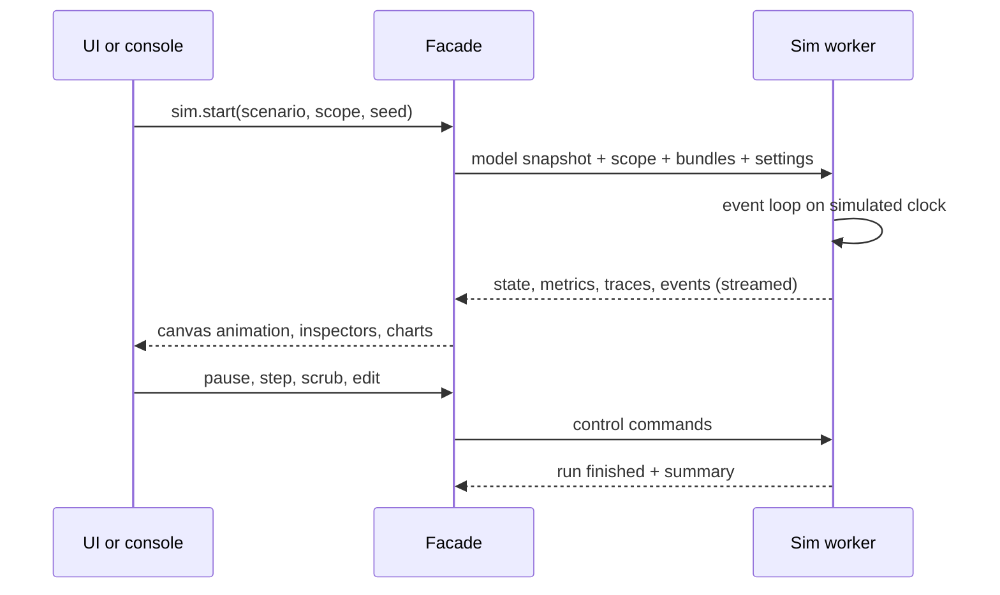

# 11. Simulation engine

Simulation is Strata's core feature. It is a deterministic discrete-event engine in a Web Worker: the same model, scope, seed and edits always produce the same run. It combines performance simulation (latency, capacity, queueing) with functional simulation (real payloads and state), and runs much faster than real time.

## Kernel

- Binary-heap event queue ordered by integer microseconds of simulated time.
- Seeded PRNG per run; each component gets a derived stream, so adding a component does not change another's randomness.
- Snapshots of all component state every 10,000 events (configurable) and at every pause make stepping back and replaying from any moment fast (§12).
- Playback speed from 0.1× to maximum. Animation replays the event stream, so the speed setting never changes results.

## Method dispatch

- Every hop is a public-method call: a message arrives on a port and names a method. The kernel dispatches it to the component's own handler (black box) or, for an expanded composite, through the boundary binding to a component inside.
- Private method calls run within the caller's processing, add their declared latency, and are recorded as child spans.
- A method awaiting `ctx.send` suspends until the response arrives in simulated time. Other messages keep being processed meanwhile.

## Messages

A message carries `id`, `traceId`, `spanId`, `parentSpanId`, `kind` (request, response, event), `method` (the public method called), protocol details (HTTP verb and path, gRPC service, topic), `headers`, `body`, `sizeBytes`, `deadline`, `attempt` and free-form `meta`. Traces follow the OpenTelemetry shape, so exporting to real tracing tools is straightforward later.

## Scope

A run can cover all or part of the architecture.

| Scope | What runs |
| --- | --- |
| Whole project | Every component at every level, subject to each composite's run mode |
| One system | That system's graph at any depth; its boundary ports become the entry and exit points |
| Selection | Only the selected components and the edges between them |
| Request path | Only the components that one scenario's requests touch, found by a first trace run |

- Components outside the scope are dimmed on the canvas and do not run.
- **Outbound stubs:** every edge leaving the scope ends in a stub that answers calls, in one of three modes:
  - **Fixed:** a latency distribution, an error rate and a response template.
  - **Recorded:** replays responses captured at that edge during an earlier, wider run.
  - **Black box:** the out-of-scope component runs as a black box, without making its own downstream calls.
- **Inbound traffic:** edges entering the scope are driven by a scenario, or by replaying traffic recorded at that edge in an earlier run.
- A scope is saved with its scenario, so runs and tests are repeatable. Scopes combine with run modes: a whole-project run can still treat one subsystem as a black box.

## Sources and load

- **Scenarios:** ordered steps with variables and extraction (`POST /login` → capture `$.token` → `GET /orders`), think time and inline checks.
- **R0 runs** send one request or a short sequence, which is ideal for following and stepping through. Load profiles arrive in R1: constant, ramp, step, spike, Poisson arrivals, and replay from a CSV of timestamps.
- **Injection points:** client components, any boundary port, or any public method of any component for unit-style runs.

## Routing and resources

- Edge rules match method, path prefix, header, weight % or an expression (ADR 0019). Component code chooses the port with `ctx.send`, and the rules of the edges leaving it choose the edge: edges whose conditions match beat edges with none, and weights split the rest.
- Services are multi-server queues: instances × concurrency servers, a bounded backlog, timeouts, retries with backoff and jitter, and circuit breakers.
- Autoscalers read metrics with a configurable delay and cooldown, so scale-up lag shows up in results.
- Every edge adds network latency, transmission delay (size ÷ bandwidth) and loss. A request with no response within its edge's timeout is retried after a backoff that doubles each time and moves by the jitter, and every attempt is a span in the trace.

## Functional behaviour

Stores keep real data in their typed state, seeded from initial values or fixtures. A request to create an order really inserts a row that a later `getOrder` returns.

## Chaos

Faults are scheduled on a timeline or in code: component down, added latency, error rate %, packet loss, network partition between zones, consumers scaled to zero, and dependency outage windows. Example: "at 30 s take `orders-db` primary down for 20 s".

## Outputs

- Per-component and per-edge time series in 1 s buckets; percentiles from log-bucketed histograms.
- Traces: 100% for short runs, sampled under load (default 1%, configurable).
- Canvas overlays: utilisation, latency, error rate, queue depth; edge thickness by throughput.
- Bottleneck finder: highest utilisation on the critical path, with a plain-language explanation.
- Cost estimate from pricing properties (R3).

## Reproducibility and comparison

Each run stores the model revision hash, component versions, scope, seed, settings, and any edits made while paused (§12), so it can be re-run exactly. Any two runs can be compared side by side, including a branch against its parent.

Performance target: at least 200,000 events per second on a 2023 mid-range laptop. A 500-component system at 1,000 req/s for 60 simulated seconds should finish in under 10 s.

---
Part of the [Strata Product and Technical Specification](README.md).
