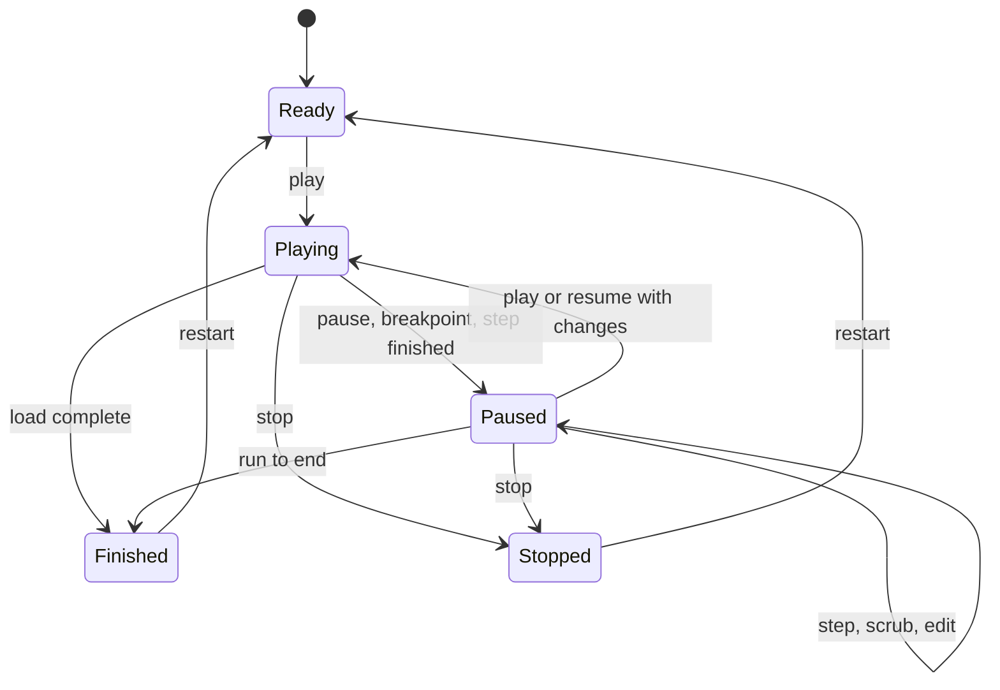

# 12. Simulation controls and run lifecycle

Runs are driven from a control bar that is always visible on the canvas. A run can be paused at any moment, inspected, stepped backward or forward, edited, and then resumed, replayed from a chosen moment, or restarted.

## Run states

## Controls

| Control | Behaviour | Keys |
| --- | --- | --- |
| Play | Starts or continues at the chosen speed | Mod+Enter or F8 |
| Pause | Stops at the next event boundary; everything stays inspectable | Mod+Enter or F8 |
| Stop | Ends the run and keeps partial results for inspection and comparison | Mod+. |
| Restart | Starts a fresh run from time zero with the same scope and seed, plus any changes kept | Alt+Home |
| Run to end | Runs at full speed, animation off, until the load completes or a breakpoint hits | Alt+End |
| Step forward n | Advances n steps in the chosen unit, then pauses | F10 |
| Step back n | Moves back n steps, restoring the exact earlier state | Shift+F10 |
| Step into, step out | Enters a private method call or an expanded composite's inner system; leaves it | Alt+F10, Alt+Shift+F10 |
| Speed | 0.1× to maximum; affects animation only, never results | None |
| Scrubber | Drag to any moment; the canvas and inspectors show state at that moment | Arrow keys when focused |

## Step units

| Unit | One step is |
| --- | --- |
| Event | One kernel event |
| Hop | One message arriving at any component |
| Followed hop | One hop of the request you are following, so "back 3" retraces its last three components |
| Method call | One public or private method call starting or finishing |
| Time | A chosen slice of simulated time, such as 10 ms |

- The count n sits between the step buttons (default 1) and is remembered per project.
- To follow a request, select any message or trace span and choose Follow. The camera tracks it across levels, drilling into composites it enters.

## Scrubber and markers

The scrubber spans the run's simulated time. Markers show breakpoint hits, fault windows, errors, edits made while paused, and branch points. Stepping back or scrubbing restores the nearest earlier snapshot and replays deterministically to the exact moment, so the canvas always shows the true state at that point.

## Editing a paused run

- While paused, you can change properties, any component's state, behaviour code and structure (add, remove or rewire components).
- Changes are **run-only** by default. They apply to this run and show as run-only changes in the inspector. At the end of the run, or at any time, choose **Keep in model**, which applies them as normal undoable commands, or **Discard**.
- Then choose how to continue:

| Continue with | What happens | Available for |
| --- | --- | --- |
| Resume with changes | Continues from the current moment with the changes in effect from now on | Property and state changes |
| Replay from here | Creates a branch run: restores the state at the scrubbed moment, applies the changes and continues | All changes, when state schemas are still compatible |
| Restart with changes | Starts a new run from time zero with the same seed and the changes applied | All changes |

Code and structural changes can't simply resume, because in-flight work may depend on the old code or shape. Strata offers Replay from here when existing state still fits the schema, and otherwise Restart with changes.

## Run tree

- Every Replay from here creates a branch that shares its parent's history up to the branch point.
- The Runs panel shows runs as a tree. Any two runs, including branches, can be compared side by side: metrics, traces, and state at the same moment.
- Each run records its parent, branch point, edits and seed, so every branch is exactly reproducible.

---
Part of the [Strata Product and Technical Specification](README.md).
