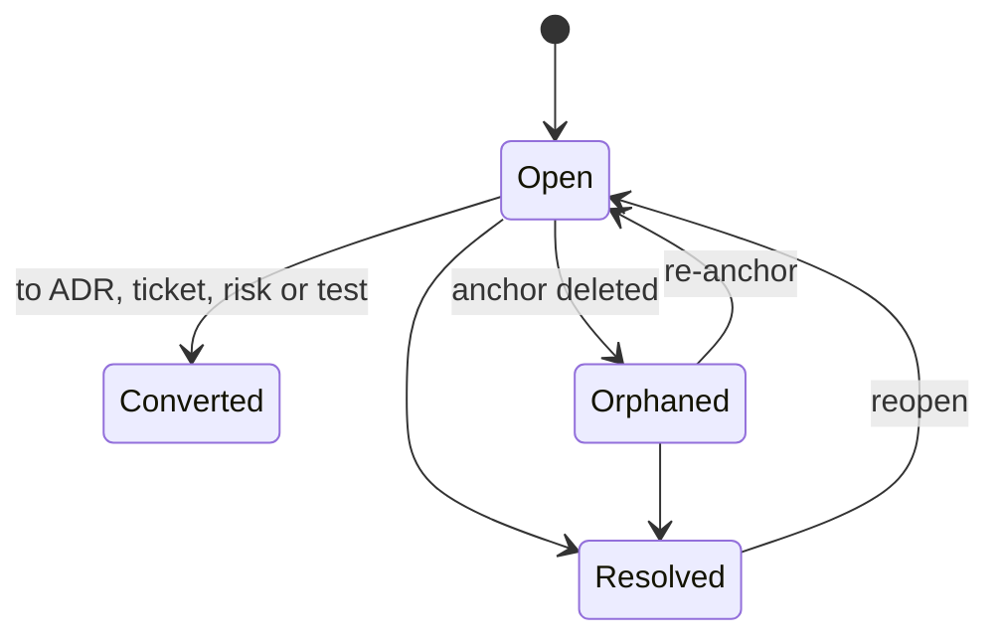

# 17. Annotations and comments

Strata has two distinct features: annotations are visible notes that belong to a diagram and are exported with it; comments are threaded discussions anchored to anything and hidden from exports by default. Both are built multi-user from R0, with local identities that become real accounts in R4.

|  | Annotations | Comments |
| --- | --- | --- |
| Purpose | Explain the diagram to readers | Discuss, question, decide |
| Forms | Sticky notes, callouts with leader lines, text, highlight regions, frames | Threads with replies |
| Belongs to | A view | Any entity (below) |
| Exported | Yes | No, unless requested |
| Conversion | Annotation → thread | Thread → annotation, ADR, ticket, risk, test |

## What a comment can anchor to

| Anchor | Stored as | If the target changes |
| --- | --- | --- |
| Whole architecture or any system | systemId | Stays |
| Node, edge, port | elementId | Marked "changed since" with a diff |
| A single property | elementId + property path, e.g. `props.retention` | Shows old and new value |
| A state field | elementId + state path, e.g. `state.messages` | Shows old and new value |
| A public or private method | elementId + method name | Marked "changed since" when its signature or code changes |
| Canvas point or region | viewId + position relative to the nearest node | Moves with that node |
| Doc text range | docId + stable text position, with quoted-text fallback | Re-anchors to the quote |
| Ticket, test, scenario, ADR | entity id | Stays |
| Simulation run | runId + spanId or time range, e.g. "the spike at 32 s" | Stays; the run is immutable |
| Snapshot or diff | snapshotId + change id | Stays |

## Thread model

- **Thread:** id (ULID), anchor, type (comment, question, suggestion, risk, decision-needed, to-do), status, labels, participants, model revision at creation, and an anchor snapshot (name and props at the time).
- **Comment:** id, threadId, author, Markdown body with `@mentions` and `#entity` links, created and edited times, reactions; attachments in R4.
- **Audit:** resolve, reopen and convert actions are recorded with actor and time.

## Behaviour

- **Outdated detection:** when the anchored element changes after a comment, the thread shows what changed, so reviewers know if a concern still applies.
- **Orphans:** deleting an element moves its threads to an Orphaned tray with the saved snapshot; they can be re-anchored.
- **Roll-up:** composite nodes show badges counting open threads inside them by type, and the system comment panel lists the whole subtree with a depth filter.
- **Conversions:** a decision-needed thread becomes an ADR draft, a to-do becomes a ticket, a risk joins the risk register, and "what if the DB fails?" becomes a resilience test stub. Links go both ways.
- **On canvas:** pins at anchors, a comment layer toggle, filters (mine, open, type, mentions me) and a list in the inspector. Press C to comment on the selection.

## Built for collaboration from R0

- **R0–R3:** a local identity profile (display name, colour, ULID user id) signs every comment. Threads live in the project file, so they travel through export and git.
- **Merge-friendly by design:** comments are an append-mostly collection. Thread fields use last-writer-wins per field and comments form an add-wins set, so offline edits merge without conflicts.
- **R4:** local identities map to accounts on first import to a workspace. Added features: live comment updates, presence in threads, @mention notifications, watching an element or system, and an in-app inbox.
- **R4 suggestions:** a suggestion comment carries a model patch (a property change or structural edit) previewed as a ghost overlay; accepting applies it as a normal command.
- **R4 review mode:** request review on a system or doc at a snapshot; reviewers comment and approve or request changes.
- **Permissions (R4–R5):** Owner, Editor, Commenter and Viewer. Resolving is allowed for the thread author, the anchor's owner and editors. R5 adds guest commenters and internal-only threads.
- **R5:** email digests and notification webhooks.

---
Part of the [Strata Product and Technical Specification](README.md).
