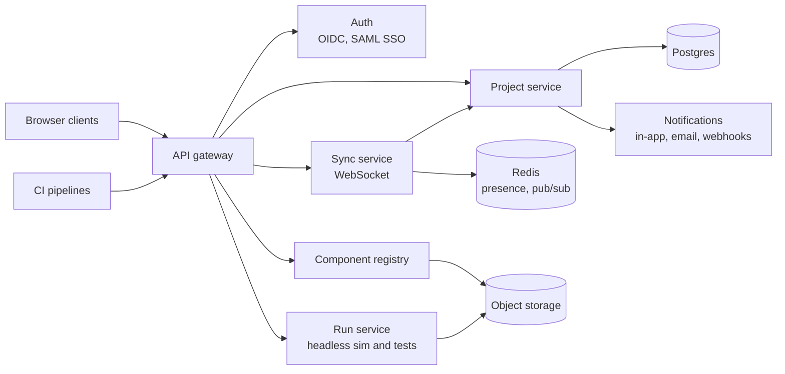

# 20. Collaboration and SaaS architecture

Collaboration arrives in three steps: git-based teamwork in R3, real-time co-editing on a self-hostable sync server in R4, and a multi-tenant SaaS in R5. Because every change is already a semantic command with a ULID and an author, each step extends the R0 data model instead of replacing it.

## R3: git-based teamwork

- The project folder format (§19) makes projects diffable in git.
- `strata merge` is a semantic 3-way merge driver that replays commands instead of merging JSON text.
- Visual diff shows added, removed and changed nodes, edges and props on the canvas, per system and across levels.
- What-if branches live inside one project for quick alternatives, such as "queue vs direct call".

## R4: real-time sync

- **Model:** server-authoritative op log. Clients apply commands optimistically, the server orders them, and clients rebase pending commands on the confirmed sequence.
- **Conflicts:** two edits to the same field resolve last-writer-wins with a visible notice and one-click restore of the losing value. Structural conflicts (editing a deleted node) become orphans, like comments.
- **Doc text:** a sequence CRDT for rich-text bodies, so concurrent typing merges character by character.
- **Offline:** commands queue in IndexedDB and rebase on reconnect.
- **Presence:** cursors, selections, avatars on the breadcrumb showing who is in which system, and follow mode.
- **Permissions per system:** a team can own its subsystem while others only comment, which fits the recursive model.

## R5: multi-tenant SaaS

- **Tenancy:** organisation id on every row with row-level security in Postgres; per-tenant encryption keys for bundles and exports.
- **Registry:** organisation-private and public component catalogues with signed bundles, versions and usage counts.
- **Run service:** isolated workers run simulations and tests for CI through the public API.
- **Integrations:** public REST API, webhooks (test failed, ADR accepted, review requested), two-way Jira sync, Confluence export.
- **Enterprise:** SSO, SCIM provisioning, RBAC, audit log, data residency options, usage-based billing.

Strata's own SaaS architecture should be modelled, simulated and documented in Strata as the first dogfooding project.

---
Part of the [Strata Product and Technical Specification](README.md).
